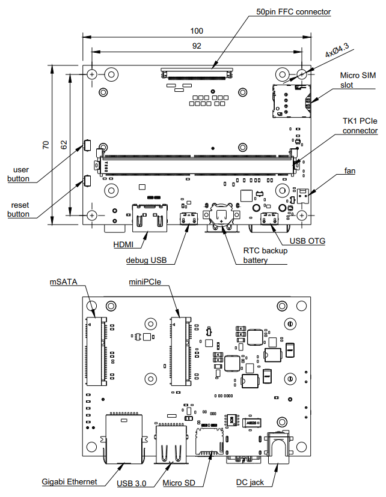

=============================
Apalis Smart Vision Baseboard
=============================

Copyright (c) 2016-2020 `Antmicro <https://www.antmicro.com>`_

.. image:: Images/apalis-baseboard.png

Overview
========

This repository contains open hardware design files for Antmicro’s Apalis Smart Vision Baseboard - a custom baseboard for the Toradex `Apalis family <https://www.toradex.com/computer-on-modules/apalis-arm-family>`_ of SoMs (Systems on Module). The board has a unified FFC connector exposing the MIPI CSI-2 interfaces of the Apalis modules. The FFC connector is electrically compatible with a range of image acquisition platforms developed by Antmicro.

Repository structure
--------------------

The main repository directory contains the Altium PCB project file, the Outjob file, LICENSE and README.
The remaining files are stored in the following directories:

* ``PCB`` -  contains all Altium design files
* ``Libraries`` - contains the component libraries
* ``Documentation`` - contains selected files for device fabrication (schematics in PDF, BoM) generated from the Altium project files
* ``Images`` - contains graphics for this README
* ``3DModel`` - contains files defining the mechanical model of the assembled board

Key features
============

* Toradex Apalis SoM edge connector
* FFC interface exposing up to 2 x 4-lane MIPI CSI-2, depending on the Apalis SoM used
* mSATA connector
* miniPCIe connector
* USB 3.0 host interface
* HDMI output interface
* 2 x Micro USB (debug and OTG)
* Gigabit Ethernet RJ45 connector
* Micro SIM slot
* RTC battery backup
* 9-24V DC power supply voltage

The PCB project files were prepared in Altium Designer 14.1.

Board layout & dimensions
=========================

The picture below presents a general layout of the PCB with marked I/O interfaces.

Getting started
===============

The board can be produced and assembled using the provided design files.
Refer to the mechanical layers for more information regarding the PCB stackup recommended for fabrication.
The board accepts power supply voltage in the 6-24VDC range.
It is recommended to use a 12V 2A DC supply to power the board.
The module will start automatically right after applying a power supply.

Debug UART connection
---------------------

Most of the debug messages are provided through the serial console.
The board is equipped with an FTDI chip providing the UART interface to the host PC.
Refer to the schematic sheets for more details.
The default debug UART channel is accessible through ``/dev/ttyUSB0`` (assuming that there are no other FTDI units connected to your PC).
The default baudrate for the serial debug connection is 115200 baud with an 8-bit transmission, 1 stop bit and with no flow control.

License
=======

`MIT <LICENSE>`_
